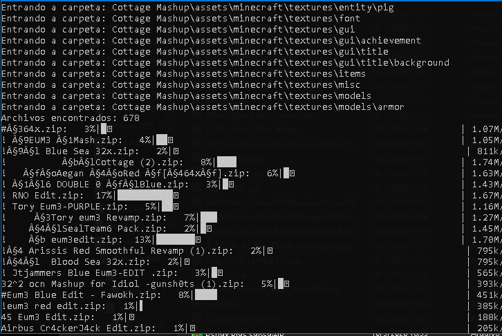

<h1 align="center">MediaFire Bulk Downloader</h1>

<p align="center">
Download MediaFire files and entire folders automatically.
</p>

<p align="center">
  
  
  
  
  
</p>

---

# Overview

**MediaFire Folder Downloader** is a small Python script that allows you to download files or entire folders from MediaFire automatically.

Instead of downloading files one by one manually, the script scans the folder, detects subfolders and downloads everything in parallel.

This is especially useful when you have large MediaFire folders containing multiple packs or files.

---

# Features

• Download individual MediaFire files  
• Download complete MediaFire folders  
• Recursive subfolder support  
• Parallel downloads for better speed  
• Progress bar for each file  
• Automatic folder structure creation  
• Works with large MediaFire collections  

---

# Preview

<p align="center">

</p>

---

# Installation

Clone the repository:

```bash
git clone https://github.com/YOURUSER/mediafire-bulk-downloader.git
cd mediafire-bulk-downloader
```

Install the required dependencies:

```bash
pip install requests beautifulsoup4 tqdm
```

---

# Usage

1. Open the file:

```
links.txt
```

2. Paste your MediaFire links inside.

Example:

```
https://www.mediafire.com/file/xxxxx/file.zip
https://www.mediafire.com/folder/xxxxx/packs
```

3. Run the script:

```bash
python mediafire_downloader.py
```

Downloaded files will appear in:

```
downloads/
```

---

# Project Structure

```
mediafire-bulk-downloader
│
├── mediafire_downloader.py
├── links.txt
├── README.md
└── downloads/
```

---

# Building an EXE

If you want to convert the script to a standalone `.exe`:

Install PyInstaller:

```bash
pip install pyinstaller
```

Build the executable:

```bash
pyinstaller --onefile --clean --name MediaFireDownloader mediafire_downloader.py
```

The executable will appear in:

```
dist/
```

---

# Requirements

Python 3.8+

Libraries used:

- requests
- beautifulsoup4
- tqdm

---

# Notes

MediaFire can change their website structure or API at any time.  
If that happens the script may stop working until it is updated.

---

# License

MIT License

You are free to use, modify and distribute this project.

---

# Tags

mediafire downloader  
python downloader  
mediafire automation  
bulk downloader  
folder downloader  
parallel downloads  
python script  
mediafire bulk download  

---
